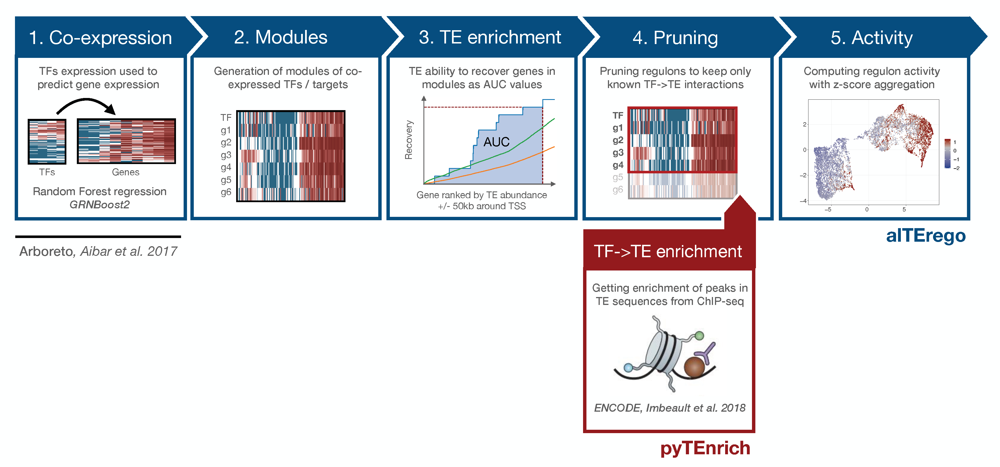

.. pyTEnrich documentation master file, created by
   sphinx-quickstart on Wed Dec 30 11:29:02 2020.
   You can adapt this file completely to your liking, but it should at least
   contain the root `toctree` directive.

.. image:: images/alTErego_logo_new.jpf

.. toctree::
   :maxdepth: 2
   :caption: Contents: 
   
   usage/installation.rst
   usage/execution.rst
    
`source code on github <https://c4science.ch/diffusion/11057>`_

Overview of the methods
=======================

This method takes advantage of Co-Expression method from GRNBoost2 from `arboreto <https://arboreto.readthedocs.io/en/latest/>`_ as used in `SCENIC method <https://www.nature.com/articles/nmeth.4463>`_. On top of the original method, we used a method to use TE in TSS neighborhood (+/- 50kb) using a similar approach that SCENIC uses with motifs. Using ChIP-seq enrichment of TF->TE interactions, we then prune the results to keep only regulons from known TF->TE interactions. 

This program aims at defining regulons of putative targets for Transcription Factors (TFs) targetting Transposable Elements (TEs) sequences. The whole method is built on the hypothesis that TEs found in close proximity of gene promoters are potentially behaving as enhancer for the genes. Using prior knowledge from ChIP-seq experiments, we know roughly what TFs are able to bind which TEs families. Then, by looking at TEs in the neighborhood of genes co-expressed with TFs, we can define TE-derived regulons.
